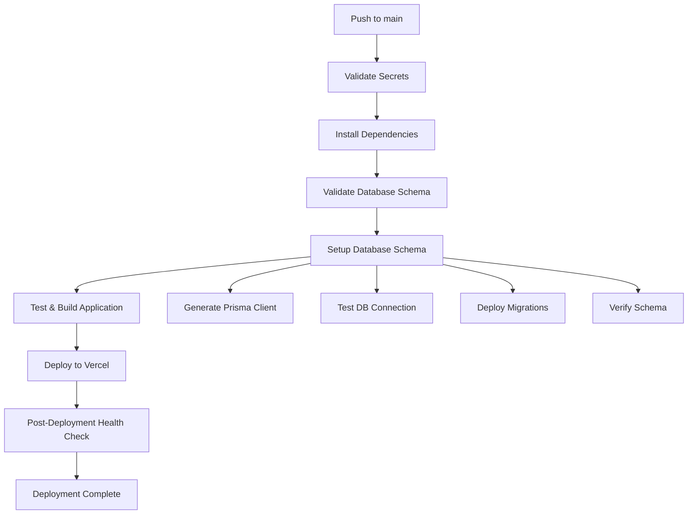

# GitHub Actions Database Setup - Implementation Summary

## ✅ What Was Implemented

I've successfully added a comprehensive database schema setup step to your GitHub Actions deployment process. This ensures that every deployment includes all the latest database changes and maintains data integrity.

## 🔄 Enhanced Deployment Workflow

### Updated Files

1. **`.github/workflows/deploy-production.yml`** - Enhanced production deployment workflow
2. **`.github/workflows/ci.yml`** - Enhanced CI workflow with database validation
3. **`DATABASE_DEPLOYMENT_GUIDE.md`** - Comprehensive deployment guide

### New Deployment Process

The GitHub Actions workflow now includes these database-related steps:

#### 1. Database Environment Validation
```yaml
- name: Validate Database Environment Variables
  # Checks that all required database secrets are configured:
  # - POSTGRES_PRISMA_URL (connection pooling)
  # - POSTGRES_URL_NON_POOLING (direct connection)
  # - NEXTAUTH_SECRET (authentication)
```

#### 2. Comprehensive Database Schema Setup
```yaml
- name: Setup Database Schema
  # Step 1: Generate Prisma client
  # Step 2: Test database connection
  # Step 3: Check migration status
  # Step 4: Deploy migrations (with fallback to schema push)
  # Step 5: Verify all tables are accessible
```

#### 3. Post-Deployment Health Check
```yaml
- name: Post-Deployment Database Health Check
  # Tests database connectivity after deployment
  # Verifies table accessibility and query performance
  # Provides early warning of any issues
```

## 📋 Database Schema Included

The deployment process now automatically sets up these tables with all latest changes:

### Core Tables
- ✅ **User** - User profiles and authentication
- ✅ **Account** - OAuth provider accounts (Spotify integration)
- ✅ **Session** - User session management
- ✅ **VerificationToken** - Email verification

### Playlist Management
- ✅ **Playlist** - User playlists with `position` field for ordering
- ✅ **Song** - Song metadata with `bpm` field for BPM analysis
- ✅ **PlaylistSong** - Playlist-song relationships

### Advanced Features (Latest Changes Included)
- ✅ **PlaylistSync** - Platform synchronization tracking
- ✅ **SyncLog** - Detailed sync operation logs
- ✅ **ImportHistory** - Spotify playlist import tracking
- ✅ **PurchaseHistory** - Music purchase tracking

### Recent Enhancements
- ✅ **Position-based playlist ordering** (latest migration included)
- ✅ **BPM analysis support** (latest migration included)
- ✅ **Comprehensive sync and import tracking** (latest migration included)
- ✅ **All indexes and foreign keys** properly configured

## 🚀 Enhanced CI/CD Pipeline

### CI Workflow Improvements
- **Schema Validation**: Validates Prisma schema syntax using dummy environment variables
- **Type Generation Testing**: Ensures TypeScript types are valid (including latest schema changes)
- **Migration Analysis**: Checks for potentially destructive operations
- **Build Integration**: Verifies schema works with application build
- **No Database Required**: CI validation works without real database connections

### Production Deployment Safety
- **Pre-deployment Validation**: Fails fast if secrets are missing
- **Connection Testing**: Verifies database connectivity before proceeding
- **Migration Strategy**: Uses `prisma migrate deploy` with `db push` fallback
- **Post-deployment Verification**: Confirms deployment success

## 🔧 Required Setup

To use the new deployment process, you need to configure these GitHub secrets:

```bash
# Database Connection (Required)
POSTGRES_PRISMA_URL          # Your Neon/PostgreSQL connection pooling URL
POSTGRES_URL_NON_POOLING     # Your Neon/PostgreSQL direct connection URL

# Authentication (Required)  
NEXTAUTH_SECRET              # Random secret for NextAuth.js

# Deployment (Required)
VERCEL_TOKEN                 # Your Vercel deployment token
```

## 📊 Deployment Process Flow



## 🎯 Benefits

### Automated Database Management
- **Zero Manual Steps**: Database schema updates happen automatically
- **Migration Safety**: Proper migration deployment with fallback strategies
- **Data Integrity**: Verification steps ensure all tables are properly created
- **Performance Monitoring**: Built-in health checks monitor database performance

### Development Workflow
- **Schema Validation**: CI catches schema issues before deployment
- **Type Safety**: Ensures TypeScript types match database schema
- **Migration Tracking**: All database changes are properly versioned
- **Rollback Support**: Easy rollback if deployment issues occur

### Production Reliability
- **Environment Validation**: Fails fast if configuration is incorrect
- **Connection Testing**: Verifies database connectivity before deployment
- **Health Monitoring**: Post-deployment checks ensure everything works
- **Detailed Logging**: Comprehensive logs for troubleshooting

## 🔍 What Happens on Next Deployment

When you push to the `main` branch, the workflow will automatically:

1. ✅ **Validate** all required secrets are configured
2. ✅ **Generate** the latest Prisma client with all schema changes
3. ✅ **Test** database connectivity
4. ✅ **Deploy** all pending migrations including the latest changes:
   - Playlist position ordering
   - BPM analysis fields
   - Sync and import tracking tables
   - All indexes and relationships
5. ✅ **Verify** all tables are accessible and working
6. ✅ **Deploy** the application to Vercel
7. ✅ **Monitor** database health after deployment

## 🚨 Important Notes

### Migration Strategy
- **Production**: Uses `prisma migrate deploy` for safe, versioned migrations
- **Fallback**: Uses `prisma db push` if migrations fail (with data loss warning)
- **Verification**: Tests all tables after deployment to ensure success

### Latest Changes Included
The deployment process includes all recent database enhancements:
- **Position-based playlist ordering** for drag-and-drop functionality
- **BPM analysis support** for music analysis features
- **Comprehensive sync tracking** for Spotify integration
- **Import history tracking** for playlist import operations

### Safety Features
- **Pre-flight checks** prevent deployment with missing configuration
- **Connection testing** ensures database is accessible
- **Schema verification** confirms all tables are properly created
- **Performance monitoring** detects slow queries or connection issues

## 🎉 Ready for Production

Your GitHub Actions workflow now includes enterprise-grade database deployment with:
- ✅ Automated schema management
- ✅ Migration safety and validation
- ✅ Comprehensive health monitoring
- ✅ All latest database changes included
- ✅ Production-ready deployment process

The next time you push to `main`, your database schema will be automatically updated with all the latest changes, and your application will be deployed with full database integrity verification.

---

**Next Steps**: Configure the required GitHub secrets and push a change to trigger the enhanced deployment process!